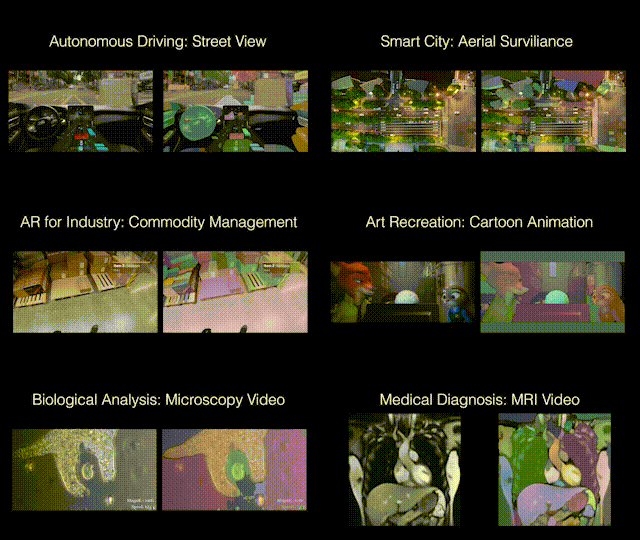

# Segment and Track Anything (SAM-Track)

<p align="center">

</p>

**Segment and Track Anything** is an open-source project that focuses on the segmentation and tracking of any objects in videos, utilizing both automatic and interactive methods. The primary algorithms utilized include the [**SAM** (Segment Anything Models)](https://github.com/facebookresearch/segment-anything) for automatic/interactive key-frame segmentation and the [**DeAOT** (Decoupling features in Associating Objects with Transformers)](https://github.com/yoxu515/aot-benchmark) (NeurIPS2022) for efficient multi-object tracking and propagation. The SAM-Track pipeline enables dynamic and automatic detection and segmentation of new objects by SAM, while DeAOT is responsible for tracking all identified objects.

## :loudspeaker:New Features
- We have introduced a new WebUI that allows interactive user segmentation through strokes and clicks. Feel free to explore and have fun with the [tutorial](./tutorial/1.0-Version.md)!
    - Check out our new video tutorials!
      - YouTube-Link: [Tutorial for Interactively modify single-object mask for first frame of video](https://www.youtube.com/watch?v=DF0iFSsX8KY)、[Tutorial for Interactively add object by click](https://www.youtube.com/watch?v=UJvKPng9_DA)、[Tutorial for Interactively add object by stroke](https://www.youtube.com/watch?v=m1oFavjIaCM).
      - Bilibili Video Link:[Tutorial for Interactively modify single-object mask for first frame of video](https://www.bilibili.com/video/BV1tM4115791/?spm_id_from=333.999.0.0)、[Tutorial for Interactively add object by click](https://www.bilibili.com/video/BV1Qs4y1A7d1/)、[Tutorial for Interactively add object by stroke](https://www.bilibili.com/video/BV1Lm4y117J4/?spm_id_from=333.999.0.0).
    - 1.0-Version is a developer version, please feel free to contact us if you encounter any bugs :bug:.

## :fire:Demos
<div align=center>

[](https://youtu.be/UPhtpf1k6HA "Segment-and-Track-Anything Versatile Demo")
</div>

This video showcases the segmentation and tracking capabilities of SAM-Track in various scenarios, such as street views, AR, cells, animations, aerial shots, and more.

## :calendar:TODO
 - [ ] Colab notebook
 - [x] 1.0-Version Interactive WebUI
    - We will create a feature that enables users to interactively modify the mask for the initial video frame according to their needs. The interactive segmentation capabilities of Segment-and-Track-Anything is demonstrated in [Demo1](https://www.youtube.com/watch?v=ctnD03w-5VA) and [Demo2](https://www.youtube.com/watch?v=DfCUGUxALYo).
    - Bilibili Video Link: [Demo1](https://www.bilibili.com/video/BV1JL411v7uE/), [Demo2](https://www.bilibili.com/video/BV1Qs4y1w763/).
 - [ ] 1.5-Version Interactive WebUI
    - We will develop a function that allows interactive modification of multi-object masks for the first frame of a video. This function will be based on Version 1.0.
    - Furthermore, we plan to include text prompts as an additional form of interaction.
 - [ ] 2.x-Version Interactive WeiUI
    - In version 2.x, the segmentation model will offer two options: SAM and SEEM.
    - We will develop a new function where the fixed-category object detection result can be displayed as a prompt.

**Demo1** showcases SAM-Track's ability to interactively segment and track individual objects.  The user specified that SAM-Track tracked a man playing street basketball.
<div align=center>

[](https://www.youtube.com/watch?v=Xyd54AngvV8 "Interactive Segment-and-Track-Anything Demo1")
</div>

**Demo2** showcases SAM-Track's ability to interactively add specified objects for tracking.The user customized the addition of objects to be tracked on top of the segmentation of everything in the scene using SAM-Track.
<div align=center>
 
[](https://www.youtube.com/watch?v=eZrdna8JkoQ "Interactive Segment-and-Track-Anything Demo2")
</div>

## :computer:Getting Started
### :bookmark_tabs:Requirements

The [Segment-Anything](https://github.com/facebookresearch/segment-anything) repository has been cloned and renamed as sam, and the [aot-benchmark](https://github.com/yoxu515/aot-benchmark) repository has been cloned and renamed as aot.

Please check the dependency requirements in [SAM](https://github.com/facebookresearch/segment-anything) and [DeAOT](https://github.com/yoxu515/aot-benchmark).

The implementation is tested under python 3.9, as well as pytorch 1.10 and torchvision 0.11. **We recommend equivalent or higher pytorch version**.

Use the `install.sh` to install the necessary libs for SAM-Track
```
bash script/install.sh
```

### :star:Model Preparation
Download SAM model to ckpt, the default model is SAM-VIT-B ([sam_vit_b_01ec64.pth](https://dl.fbaipublicfiles.com/segment_anything/sam_vit_b_01ec64.pth)).

Download DeAOT/AOT model to ckpt, the default model is R50-DeAOT-L ([R50_DeAOTL_PRE_YTB_DAV.pth](https://drive.google.com/file/d/1QoChMkTVxdYZ_eBlZhK2acq9KMQZccPJ/view)).

You can download the default weights using the command line as shown below.
```
bash script/download_ckpt.sh
```

### :heart:Run Demo
- The video to be processed can be put in ./assets. 
- Then run **demo.ipynb** step by step to generate results. 
- The results will be saved as masks for each frame and a gif file for visualization.

The arguments for SAM-Track, DeAOT and SAM can be manually modified in model_args.py for purpose of using other models or controling the behavior of each model.

### :muscle:WebUI App
Our user-friendly visual interface allows you to easily obtain the results of your experiments. Simply initiate it using the command line.

```
python app.py
```
Users can upload the video directly on the UI and use SegTracker to automatically/interactively track objects within that video. We use a video of a man playing basketball as an example.


SegTracker-Parameters:
 - **aot_model**: used to select which version of DeAOT/AOT to use for tracking and propagation.
 - **sam_gap**: used to control how often SAM is used to add newly appearing objects at specified frame intervals. Increase to decrease the frequency of discovering new targets, but significantly improve speed of inference.
 - **points_per_side**: used to control the number of points per side used for generating masks by sampling a grid over the image. Increasing the size enhances the ability to detect small objects, but larger targets may be segmented into finer granularity.
 - **max_obj_num**: used to limit the maximum number of objects that SAM-Track can detect and track. A larger number of objects necessitates a greater utilization of memory, with approximately 16GB of memory capable of processing a maximum of 255 objects.

Usage: To see the details, please refer to the [tutorial for 1.0-Version WeiUI](./tutorial/1.0-Version.md).
 <!-- - Start app, use your browser to open the web-link.
 - Click on the `input-video window` to upload a video.
 - Adjust SAM-Track parameters as needed.
 - Click `Seg and Track` to get the experiment results. -->

### :full_moon_with_face:Credits
Licenses for borrowed code can be found in `licenses.md` file.

* DeAOT/AOT - [https://github.com/yoxu515/aot-benchmark](https://github.com/yoxu515/aot-benchmark)
* SAM - [https://github.com/facebookresearch/segment-anything](https://github.com/facebookresearch/segment-anything)
* Gradio (for building WebUI) - [https://github.com/gradio-app/gradio](https://github.com/gradio-app/gradio)

### :school:About us
Thank you for your interest in this project. The project is supervised by the ReLER Lab at Zhejiang University’s College of Computer Science and Technology. ReLER was established by Yang Yi, a Qiu Shi Distinguished Professor at Zhejiang University. Our dedicated team of contributors includes [Yuanyou Xu](https://github.com/yoxu515), [Yangming Cheng](https://github.com/yamy-cheng), [Liulei Li](https://github.com/lingorX), [Zongxin Yang](https://z-x-yang.github.io/), [Wenguan Wang](https://sites.google.com/view/wenguanwang) and [Yi Yang](https://scholar.google.com/citations?user=RMSuNFwAAAAJ&hl=en).
