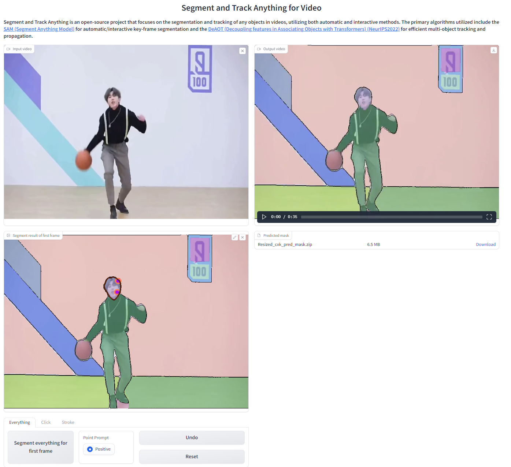

# Segment and Track Anything (SAM-Track)
**Online Demo:** [](https://colab.research.google.com/drive/1R10N70AJaslzADFqb-a5OihYkllWEVxB?usp=sharing)
**Technical Report**: [](https://arxiv.org/abs/2305.06558)

**Tutorial:** [tutorial-v1.5 (Text)](./tutorial/tutorial%20for%20WebUI-1.5-Version.md), [tutorial-v1.0 (Click & Brush)](./tutorial/tutorial%20for%20WebUI-1.0-Version.md)

<p align="center">

</p>

**Segment and Track Anything** is an open-source project that focuses on the segmentation and tracking of any objects in videos, utilizing both automatic and interactive methods. The primary algorithms utilized include the [**SAM** (Segment Anything Models)](https://github.com/facebookresearch/segment-anything) for automatic/interactive key-frame segmentation and the [**DeAOT** (Decoupling features in Associating Objects with Transformers)](https://github.com/yoxu515/aot-benchmark) (NeurIPS2022) for efficient multi-object tracking and propagation. The SAM-Track pipeline enables dynamic and automatic detection and segmentation of new objects by SAM, while DeAOT is responsible for tracking all identified objects.

## :loudspeaker:New Features
- [2023/5/12] We have authored a technical report for SAM-Track.
- [2023/5/7] We have added `demo_instseg.ipynb`, which uses Grounding-DINO to detect new objects in the key frames of a video. It can be applied in the fields of smart cities and autonomous driving.
- [2023/4/29] We have added advanced arguments for AOT-L: `long_term_memory_gap` and `max_len_long_term`.
   - `long_term_memory_gap` controls the frequency at which the AOT model adds new reference frames to its long-term memory. During mask propagation, AOT matches the current frame with the reference frames stored in the long-term memory. 
   - Setting the gap value to a proper value helps to obtain better performance. To avoid memory explosion in long videos, we set a `max_len_long_term` value for the long-term memory storage, i.e. when the number of memory frames reaches the `max_len_long_term value`, the oldest memory frame will be discarded and a new frame will be added.

- [2023/4/26] **Interactive WebUI 1.5-Version**: We have added new features based on Interactive WebUI-1.0 Version.
   - We have added a new form of interactivity—text prompts—to SAMTrack.
   - From now on, multiple objects that need to be tracked can be interactively added.
   - Check out [tutorial](./tutorial/tutorial%20for%20WebUI-1.5-Version.md) for Interactive WebUI 1.5-Version. More demos will be released in the next few days.
- [2023/4/26] **Image-Sequence input**: The WebUI now has a new feature that allows for input of image sequences, which can be used to test video segmentation datasets. Get started with the [tutorial](./tutorial/tutorial%20for%20Image-Sequence%20input.md) for Image-Sequence input. 
- [2023/4/25] **Online Demo:** You can easily use SAMTrack in [Colab](https://colab.research.google.com/drive/1R10N70AJaslzADFqb-a5OihYkllWEVxB?usp=sharing) for visual tracking tasks.

- [2023/4/23] **Interactive WebUI:** We have introduced a new WebUI that allows interactive user segmentation through strokes and clicks. Feel free to explore and have fun with the [tutorial](./tutorial/tutorial%20for%20WebUI-1.0-Version.md)!
    - [2023/4/24] **Tutorial V1.0:** Check out our new video tutorials!
      - YouTube-Link: [Tutorial for Interactively modify single-object mask for first frame of video](https://www.youtube.com/watch?v=DF0iFSsX8KY)、[Tutorial for Interactively add object by click](https://www.youtube.com/watch?v=UJvKPng9_DA)、[Tutorial for Interactively add object by stroke](https://www.youtube.com/watch?v=m1oFavjIaCM).
      - Bilibili Video Link:[Tutorial for Interactively modify single-object mask for first frame of video](https://www.bilibili.com/video/BV1tM4115791/?spm_id_from=333.999.0.0)、[Tutorial for Interactively add object by click](https://www.bilibili.com/video/BV1Qs4y1A7d1/)、[Tutorial for Interactively add object by stroke](https://www.bilibili.com/video/BV1Lm4y117J4/?spm_id_from=333.999.0.0).
    - 1.0-Version is a developer version, please feel free to contact us if you encounter any bugs :bug:.

- [2023/4/17] **SAMTrack**: Automatically segment and track anything in video!

## :fire:Demos
<div align=center>

[](https://youtu.be/UPhtpf1k6HA "Segment-and-Track-Anything Versatile Demo")
</div>

This video showcases the segmentation and tracking capabilities of SAM-Track in various scenarios, such as street views, AR, cells, animations, aerial shots, and more.

## :calendar:TODO
 - [x] Colab notebook: Completed on April 25th, 2023.
 - [x] 1.0-Version Interactive WebUI: Completed on April 23rd, 2023.
    - We will create a feature that enables users to interactively modify the mask for the initial video frame according to their needs. The interactive segmentation capabilities of Segment-and-Track-Anything is demonstrated in [Demo8](https://www.youtube.com/watch?v=Xyd54AngvV8&feature=youtu.be) and [Demo9](https://www.youtube.com/watch?v=eZrdna8JkoQ).
    - Bilibili Video Link: [Demo8](https://www.bilibili.com/video/BV1JL411v7uE/), [Demo9](https://www.bilibili.com/video/BV1Qs4y1w763/).
 - [x] 1.5-Version Interactive WebUI: Completed on April 26th, 2023.
    - We will develop a function that allows interactive modification of multi-object masks for the first frame of a video. This function will be based on Version 1.0.  YouTube: [Demo4](https://www.youtube.com/watch?v=UFtwFaOfx2I&feature=youtu.be), [Demo5](https://www.youtube.com/watch?v=cK5MPFdJdSY&feature=youtu.be); Bilibili: [Demo4](https://www.bilibili.com/video/BV17X4y127mJ/), [Demo5](https://www.bilibili.com/video/BV1Pz4y1a7mC/)
    - Furthermore, we plan to include text prompts as an additional form of interaction. YouTube: [Demo1](https://www.youtube.com/watch?v=5oieHqFIJPc&feature=youtu.be), [Demo2](https://www.youtube.com/watch?v=nXfq17X6ohk); Bilibili: [Demo1](https://www.bilibili.com/video/BV1hg4y157yd/?vd_source=fe3b5c0215d05cc44c8eb3d94abae3ca), [Demo2](https://www.bilibili.com/video/BV1RV4y1k7i5/)
 - [ ] 2.x-Version Interactive WebUI
    - In version 2.x, the segmentation model will offer two options: SAM and SEEM.
    - We will develop a new function where the fixed-category object detection result can be displayed as a prompt.
    - We will enable SAM-Track to add and modify objects during tracking. YouTube: [Demo6](https://www.youtube.com/watch?v=l7hXM1a3nEA&feature=youtu.be
), [Demo7](https://www.youtube.com/watch?v=hPjw28Ul4cw&feature=youtu.be); Bilibili: [Demo6](https://www.bilibili.com/video/BV1nk4y1j7Am), [Demo7](https://www.bilibili.com/video/BV1mk4y1E78s/?vd_source=fe3b5c0215d05cc44c8eb3d94abae3ca)

**Demo1** showcases SAM-Track's ability to take the class of objects as prompt. The user gives the category text 'panda' to enable instance-level segmentation and tracking of all objects belonging to this category.
<div align=center>
 
[](https://www.youtube.com/watch?v=5oieHqFIJPc&feature=youtu.be "demo1")
</div>

**Demo2** showcases SAM-Track's ability to take the text description as prompt. SAM-Track could segment and track target objects given the input that 'panda on the far left'.
<div align=center>
 
[](https://www.youtube.com/watch?v=nXfq17X6ohk "demo1")
</div>


**Demo3** showcases SAM-Track's ability to track numerous objects at the same time. SAM-Track is capable of automatically detecting newly appearing objects.
<div align=center>
 
[](https://www.youtube.com/watch?v=jMqFMq0tRP0 "demo1")
</div>

**Demo4** showcases SAM-Track's ability to take multiple modes of interactions as prompt. The user specified human and skateboard with click and brushstroke, respectively.  
<div align=center>
 
[](https://www.youtube.com/watch?v=UFtwFaOfx2I&feature=youtu.be "demo1")
</div>


**Demo5** showcases SAM-Track's ability to refine the results of segment-everything. The user merges the tram as a whole with a single click.
<div align=center>
 
[](https://www.youtube.com/watch?v=cK5MPFdJdSY&feature=youtu.be "demo1")
</div>

**Demo6** showcases SAM-Track's ability to add new objects during tracking. The user annotates another car by rolling back to an intermediate frame.
<div align=center>
 
[](https://www.youtube.com/watch?v=l7hXM1a3nEA "demo1")
</div>

**Demo7** showcases SAM-Track's ability to refine the prediction during tracking. This feature is highly advantageous for segmentation and tracking under complex environments.
<div align=center>

[](https://www.youtube.com/watch?v=hPjw28Ul4cw&feature=youtu.be "demo1")
</div>

**Demo8** showcases SAM-Track's ability to interactively segment and track individual objects.  The user specified that SAM-Track tracked a man playing street basketball.
<div align=center>

[](https://www.youtube.com/watch?v=Xyd54AngvV8 "Interactive Segment-and-Track-Anything Demo1")
</div>

**Demo9** showcases SAM-Track's ability to interactively add specified objects for tracking.The user customized the addition of objects to be tracked on top of the segmentation of everything in the scene using SAM-Track.
<div align=center>
 
[](https://www.youtube.com/watch?v=eZrdna8JkoQ "Interactive Segment-and-Track-Anything Demo2")
</div>

## :computer:Getting Started
### :bookmark_tabs:Requirements

The [Segment-Anything](https://github.com/facebookresearch/segment-anything) repository has been cloned and renamed as sam, and the [aot-benchmark](https://github.com/yoxu515/aot-benchmark) repository has been cloned and renamed as aot.

Please check the dependency requirements in [SAM](https://github.com/facebookresearch/segment-anything) and [DeAOT](https://github.com/yoxu515/aot-benchmark).

The implementation is tested under python 3.9, as well as pytorch 1.10 and torchvision 0.11. **We recommend equivalent or higher pytorch version**.

Use the `install.sh` to install the necessary libs for SAM-Track
```
bash script/install.sh
```

### :star:Model Preparation
Download SAM model to ckpt, the default model is SAM-VIT-B ([sam_vit_b_01ec64.pth](https://dl.fbaipublicfiles.com/segment_anything/sam_vit_b_01ec64.pth)).

Download DeAOT/AOT model to ckpt, the default model is R50-DeAOT-L ([R50_DeAOTL_PRE_YTB_DAV.pth](https://drive.google.com/file/d/1QoChMkTVxdYZ_eBlZhK2acq9KMQZccPJ/view)).

Download Grounding-Dino model to ckpt, the default model is GroundingDINO-T ([groundingdino_swint_ogc](https://huggingface.co/ShilongLiu/GroundingDINO/resolve/main/groundingdino_swint_ogc.pth)).

You can download the default weights using the command line as shown below.
```
bash script/download_ckpt.sh
```

### :heart:Run Demo
- The video to be processed can be put in ./assets. 
- Then run **demo.ipynb** step by step to generate results. 
- The results will be saved as masks for each frame and a gif file for visualization.

The arguments for SAM-Track, DeAOT and SAM can be manually modified in model_args.py for purpose of using other models or controling the behavior of each model.

### :muscle:WebUI App
Our user-friendly visual interface allows you to easily obtain the results of your experiments. Simply initiate it using the command line.

```
python app.py
```
Users can upload the video directly on the UI and use SegTracker to automatically/interactively track objects within that video. We use a video of a man playing basketball as an example.



SegTracker-Parameters:
 - **aot_model**: used to select which version of DeAOT/AOT to use for tracking and propagation.
 - **sam_gap**: used to control how often SAM is used to add newly appearing objects at specified frame intervals. Increase to decrease the frequency of discovering new targets, but significantly improve speed of inference.
 - **points_per_side**: used to control the number of points per side used for generating masks by sampling a grid over the image. Increasing the size enhances the ability to detect small objects, but larger targets may be segmented into finer granularity.
 - **max_obj_num**: used to limit the maximum number of objects that SAM-Track can detect and track. A larger number of objects necessitates a greater utilization of memory, with approximately 16GB of memory capable of processing a maximum of 255 objects.

Usage: To see the details, please refer to the [tutorial for 1.0-Version WebUI](./tutorial/tutorial%20for%20WebUI-1.0-Version.md).

### :school:About us
Thank you for your interest in this project. The project is supervised by the ReLER Lab at Zhejiang University’s College of Computer Science and Technology. ReLER was established by Yang Yi, a Qiu Shi Distinguished Professor at Zhejiang University. Our dedicated team of contributors includes [Yangming Cheng](https://github.com/yamy-cheng), [Yuanyou Xu](https://github.com/yoxu515), [Liulei Li](https://github.com/lingorX), [Xiaodi Li](https://github.com/LiNO3Dy), [Zongxin Yang](https://z-x-yang.github.io/), [Wenguan Wang](https://sites.google.com/view/wenguanwang) and [Yi Yang](https://scholar.google.com/citations?user=RMSuNFwAAAAJ&hl=en).

### :full_moon_with_face:Credits
Licenses for borrowed code can be found in [licenses.md](https://github.com/z-x-yang/Segment-and-Track-Anything/blob/main/licenses.md) file. 

* DeAOT/AOT - [https://github.com/yoxu515/aot-benchmark](https://github.com/yoxu515/aot-benchmark)
* SAM - [https://github.com/facebookresearch/segment-anything](https://github.com/facebookresearch/segment-anything)
* Gradio (for building WebUI) - [https://github.com/gradio-app/gradio](https://github.com/gradio-app/gradio)
* Grounding-Dino - [https://github.com/yamy-cheng/GroundingDINO](https://github.com/yamy-cheng/GroundingDINO)

### License
The project is licensed under the [AGPL-3.0 license](https://github.com/z-x-yang/Segment-and-Track-Anything/blob/main/LICENSE.txt). To utilize or further develop this project for commercial purposes through proprietary means, permission must be granted by us (as well as the owners of any borrowed code).

### Citations
Please consider citing the related paper(s) in your publications if it helps your research.
```
@article{cheng2023segment,
  title={Segment and Track Anything},
  author={Cheng, Yangming and Li, Liulei and Xu, Yuanyou and Li, Xiaodi and Yang, Zongxin and Wang, Wenguan and Yang, Yi},
  journal={arXiv preprint arXiv:2305.06558},
  year={2023}
}
@article{kirillov2023segment,
  title={Segment anything},
  author={Kirillov, Alexander and Mintun, Eric and Ravi, Nikhila and Mao, Hanzi and Rolland, Chloe and Gustafson, Laura and Xiao, Tete and Whitehead, Spencer and Berg, Alexander C and Lo, Wan-Yen and others},
  journal={arXiv preprint arXiv:2304.02643},
  year={2023}
}
@inproceedings{yang2022deaot,
  title={Decoupling Features in Hierarchical Propagation for Video Object Segmentation},
  author={Yang, Zongxin and Yang, Yi},
  booktitle={Advances in Neural Information Processing Systems (NeurIPS)},
  year={2022}
}
@inproceedings{yang2021aot,
  title={Associating Objects with Transformers for Video Object Segmentation},
  author={Yang, Zongxin and Wei, Yunchao and Yang, Yi},
  booktitle={Advances in Neural Information Processing Systems (NeurIPS)},
  year={2021}
}
@article{liu2023grounding,
  title={Grounding dino: Marrying dino with grounded pre-training for open-set object detection},
  author={Liu, Shilong and Zeng, Zhaoyang and Ren, Tianhe and Li, Feng and Zhang, Hao and Yang, Jie and Li, Chunyuan and Yang, Jianwei and Su, Hang and Zhu, Jun and others},
  journal={arXiv preprint arXiv:2303.05499},
  year={2023}
}
```
