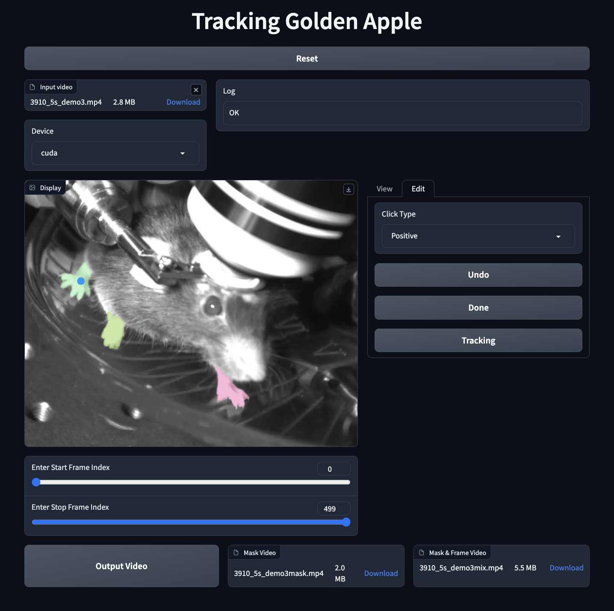

# Tracking Golden Apple

這是一個基於 Segment Anything(SA) 與 DeAOT 製作的 Video Object Tracker。

它使用 SA 篩選一個 frame 當中的物體，再透過 DeAOT 參考第一個 frame 進行推理，
當推理完成之後，可以檢查含有 Mask 的 Video，再將標注有問題的片段進行 Refine。

在使用 i7-13700 & RTX 3070 的環境下，針對 200x300 的 video，推論速度約 60 fps。

在 Mac Air M1 的環境下，針對 200x300 的 video，推論速度約 3 fps。 (如果有人贊助我 Mac Studio 192G ，我可以嘗試 8k 分辨率的 video)

# Installation

```
git clone https://github.com/RaisoLiu/Tracking-Golden-Apple
pip install -r requestment.txt
bash script/download_ckpt.sh
```

# Start 

```
python app.py
```

# Demo


[](https://youtu.be/tDOfGbpDMwE)
