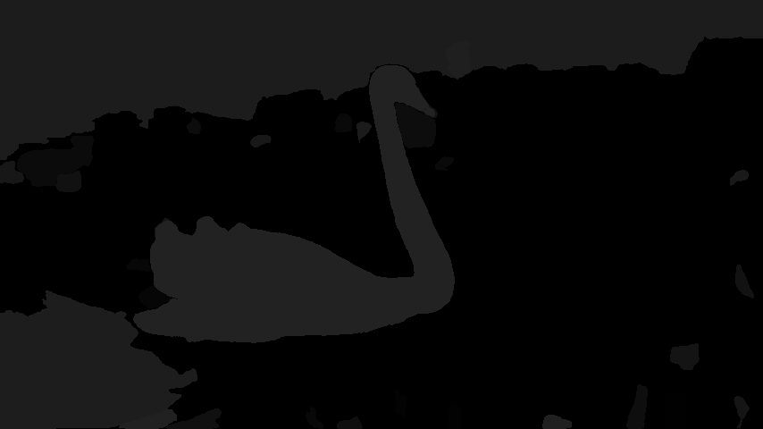
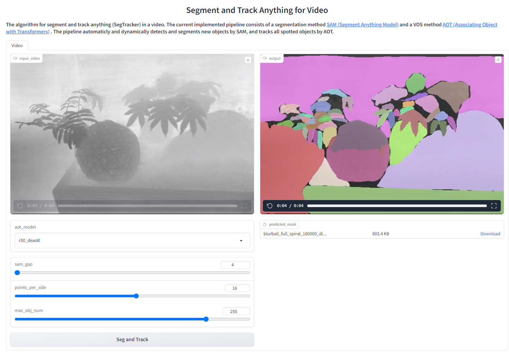

# Segment and Track Anything (SAM-Track)
**Segment and Track Anything** is an open-source project that focuses on the segmentation and tracking of any objects in videos, utilizing both automatic and interactive methods. The primary algorithms utilized include the [**SAM (Segment Anything Model)**](https://github.com/facebookresearch/segment-anything) for automatic/interactive key-frame segmentation and the [**AOT (Associating Object with Transformers)**](https://github.com/yoxu515/aot-benchmark) for efficient multi-object tracking and propagation. The SAM-Track pipeline enables dynamic and automatic detection and segmentation of new objects by SAM, while AOT is responsible for tracking all identified objects.

## Demos
<!-- ### Animals in the wild



### Human activities


**To access versatile demo of Segment-and-Track-Anything, please click [here](https://www.youtube.com/watch?v=R4aU6FotTb0).** -->
<div align=center>

[](https://youtu.be/UPhtpf1k6HA "Segment-and-Track-Anything Versatile Demo")
</div>

This video showcases the segmentation and tracking capabilities of SAM-Track in various scenarios, such as street views, AR, cells, animations, aerial shots, and more.

<!-- **Street Basketball (tracked objects > 250)** -->

## TODO
 - [ ] Colab notebook
 - [ ] 1.0-Version Interactive WebUI
    - We will develop a function that allows interactive modification of the mask for the first frame of the video based on the user's requirements. We demonstrate the interactive segmentation capabilities of Segment-and-Track-Anything in [Demo1](https://www.youtube.com/watch?v=ctnD03w-5VA) and [Demo2](https://www.youtube.com/watch?v=DfCUGUxALYo).

**Demo1** showcases SAM-Track's ability to interactively segment and track individual objects.  The user specified that SAM-Track tracked a man playing street basketball.
<div align=center>

[](https://www.youtube.com/watch?v=Xyd54AngvV8 "Interactive Segment-and-Track-Anything Demo1")
</div>

**Demo2** showcases SAM-Track's ability to interactively add specified objects for tracking.The user customized the addition of objects to be tracked on top of the segmentation of everything in the scene using SAM-Track.
<div align=center>
 
[](https://www.youtube.com/watch?v=eZrdna8JkoQ "Interactive Segment-and-Track-Anything Demo2")
</div>

## Getting Started
### Requirements

The [Segment-Anything](https://github.com/facebookresearch/segment-anything) repository has been cloned and renamed as sam, and the [aot-benchmark](https://github.com/yoxu515/aot-benchmark) repository has been cloned and renamed as aot.

Please check the dependency requirements in [SAM](https://github.com/facebookresearch/segment-anything) and [AOT](https://github.com/yoxu515/aot-benchmark).

The implementation is tested under python 3.9, as well as pytorch 1.10 and torchvision 0.11. We recommend equivalent or higher pytorch version.

To install SAM:
```
cd sam; pip install -e .
```

To install other libs:

```
pip install numpy opencv-python pycocotools matplotlib Pillow scikit-image
```
It is recommended to install [Pytorch Correlation](https://github.com/ClementPinard/Pytorch-Correlation-extension) for accelerating AOT inference.

### Model Preparation
Download SAM model to ckpt, the default model is [sam_vit_b_01ec64.pth](https://dl.fbaipublicfiles.com/segment_anything/sam_vit_b_01ec64.pth).

Download AOT model to ckpt, the default model is [R50_DeAOTL_PRE_YTB_DAV.pth](https://drive.google.com/file/d/1QoChMkTVxdYZ_eBlZhK2acq9KMQZccPJ/view).

You can download the default weights using the command line as shown below.
```
bash script/download_ckpt.sh
```

### Run Demo
- The video to be processed can be put in ./assets. 
- Then run demo.ipynb step by step to generate results. 
- The results will be saved as masks for each frame and a gif file for visualization.

The arguments for SAM-Track, AOT and SAM can be manually modified in model_args.py for purpose of using other models or controling the behavior of each model.

### WebUI App
Our user-friendly visual interface allows you to easily obtain the results of your experiments. Simply initiate it using the command line.

```
python app.py
```
Users can upload the video directly on the UI and use Segtracker to track all objects within that video. We use the depth-map video as a example.



Parameters:
 - **aot_model**: used to select which version of AOT to use for tracking and propagation.
 - **sam_gap**: used to control how often SAM is used to add newly appearing objects at specified frame intervals. Increase to decrease the frequency of discovering new targets, but significantly improve speed of inference.
 - **points_per_side**: used to control the number of points per side used for generating masks by sampling a grid over the image. Increasing the size enhances the ability to detect small objects, but larger targets may be segmented into finer granularity.
 - **max_obj_num**: used to limit the maximum number of objects that SAM-Track can detect and track. A larger number of objects necessitates a greater utilization of memory, with approximately 16GB of memory capable of processing a maximum of 255 objects.

Usage:
 - Start app, use your browser to open the web-link.
 - Click on the `input-video window` to upload a video.
 - Adjust SAM-Track parameters as needed.
 - Click `Seg and Track` to get the experiment results.

### Credits
Licenses for borrowed code can be found in `licenses.md` file.

* Associating Object with Transformers -[https://github.com/yoxu515/aot-benchmark](https://github.com/yoxu515/aot-benchmark)
* Segment Anything - [https://github.com/facebookresearch/segment-anything](https://github.com/facebookresearch/segment-anything)
* Gradio (for building WebUI) - [https://github.com/gradio-app/gradio](https://github.com/gradio-app/gradio)

### About us
Thank you for your interest in this project. Our team consists of members from the CCAI, College of Computer Science and Technology at Zhejiang University. The project is led by [Prof.Wenguan Wang](https://sites.google.com/view/wenguanwang) and [Dr.Zongxin Yang](https://z-x-yang.github.io/).
