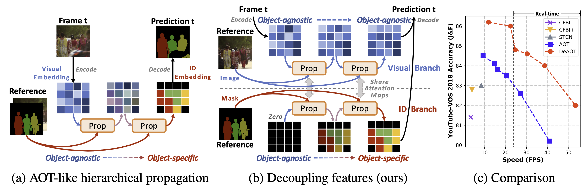
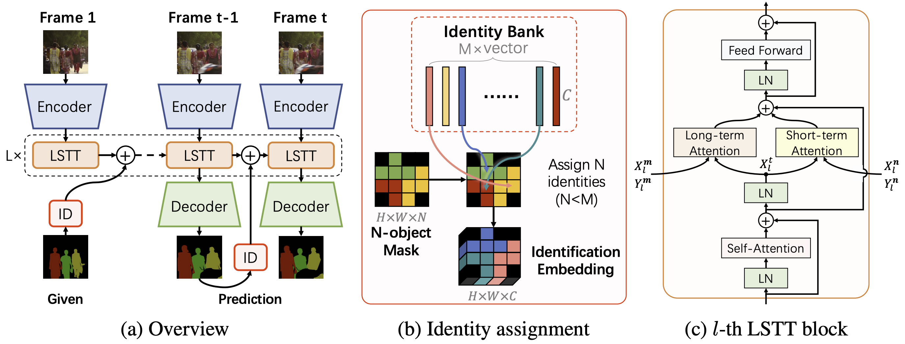

# AOT Series Frameworks in PyTorch

[](https://paperswithcode.com/sota/semi-supervised-video-object-segmentation-on-15?p=decoupling-features-in-hierarchical)
[](https://paperswithcode.com/sota/video-object-segmentation-on-youtube-vos?p=associating-objects-with-scalable)
[](https://paperswithcode.com/sota/semi-supervised-video-object-segmentation-on-18?p=associating-objects-with-scalable)
[](https://paperswithcode.com/sota/semi-supervised-video-object-segmentation-on-1?p=associating-objects-with-scalable)
[](https://paperswithcode.com/sota/visual-object-tracking-on-davis-2017?p=associating-objects-with-scalable)
[](https://paperswithcode.com/sota/visual-object-tracking-on-davis-2016?p=associating-objects-with-scalable)

A modular reference PyTorch implementation of AOT series frameworks:
- **DeAOT**: Decoupling Features in Hierachical Propagation for Video Object Segmentation (NeurIPS 2022, Spotlight) [[OpenReview](https://openreview.net/forum?id=DgM7-7eMkq0)][[PDF](https://arxiv.org/pdf/2210.09782.pdf)]


- **AOT**: Associating Objects with Transformers for Video Object Segmentation (NeurIPS 2021, Score 8/8/7/8) [[OpenReview](https://openreview.net/forum?id=hl3v8io3ZYt)][[PDF](https://arxiv.org/abs/2106.02638)]


An extension of AOT, [AOST](https://arxiv.org/abs/2203.11442) (under review), is available now. AOST is a more robust and flexible framework, supporting run-time speed-accuracy trade-offs.

## Examples
Benchmark examples:


General examples (Messi and Kobe):

 

## Highlights
- **High performance:** up to **85.5%** ([R50-AOTL](MODEL_ZOO.md#youtube-vos-2018-val)) on YouTube-VOS 2018 and **82.1%** ([SwinB-AOTL]((MODEL_ZOO.md#youtube-vos-2018-val))) on DAVIS-2017 Test-dev under standard settings (without any test-time augmentation and post processing). 
- **High efficiency:** up to **51fps** ([AOTT](MODEL_ZOO.md#davis-2017-test)) on DAVIS-2017 (480p) even with **10** objects and **41fps** on YouTube-VOS (1.3x480p). AOT can process multiple objects (less than a pre-defined number, 10 is the default) as efficiently as processing a single object. This project also supports inferring any number of objects together within a video by automatic separation and aggregation.
- **Multi-GPU training and inference**
- **Mixed precision training and inference** 
- **Test-time augmentation:** multi-scale and flipping augmentations are supported.

## Requirements
   * Python3
   * pytorch >= 1.7.0 and torchvision
   * opencv-python
   * Pillow
   * Pytorch Correlation (Recommend to install from [source](https://github.com/ClementPinard/Pytorch-Correlation-extension) instead of using `pip`. **The project can also work without this module but will lose some efficiency of the short-term attention**.)

Optional:
   * scikit-image (if you want to run our **Demo**, please install)

## Model Zoo and Results
Pre-trained models, benckmark scores, and pre-computed results reproduced by this project can be found in [MODEL_ZOO.md](MODEL_ZOO.md).

## Demo - Panoptic Propagation
We provide a simple demo to demonstrate AOT's effectiveness. The demo will propagate more than **40** objects, including semantic regions (like sky) and instances (like person), together within a single complex scenario and predict its video panoptic segmentation.

To run the demo, download the [checkpoint](https://drive.google.com/file/d/1qJDYn3Ibpquu4ffYoQmVjg1YCbr2JQep/view?usp=sharing) of R50-AOTL into [pretrain_models](pretrain_models), and then run:
```bash
python tools/demo.py
```
which will predict the given scenarios in the resolution of 1.3x480p. You can also run this demo with other AOTs ([MODEL_ZOO.md](MODEL_ZOO.md)) by setting `--model` (model type) and `--ckpt_path` (checkpoint path).

Two scenarios from [VSPW](https://www.vspwdataset.com/home) are supplied in [datasets/Demo](datasets/Demo):

- 1001_3iEIq5HBY1s: 44 objects. 1080P.
- 1007_YCTBBdbKSSg: 43 objects. 1080P.

Results:

  


## Getting Started
0. Prepare a valid environment follow the [requirements](#requirements).

1. Prepare datasets:

    Please follow the below instruction to prepare datasets in each corresponding folder.
    * **Static** 
    
        [datasets/Static](datasets/Static): pre-training dataset with static images. Guidance can be found in [AFB-URR](https://github.com/xmlyqing00/AFB-URR), which we referred to in the implementation of the pre-training.
    * **YouTube-VOS**

        A commonly-used large-scale VOS dataset.

        [datasets/YTB/2019](datasets/YTB/2019): version 2019, download [link](https://drive.google.com/drive/folders/1BWzrCWyPEmBEKm0lOHe5KLuBuQxUSwqz?usp=sharing). `train` is required for training. `valid` (6fps) and `valid_all_frames` (30fps, optional) are used for evaluation.

        [datasets/YTB/2018](datasets/YTB/2018): version 2018, download [link](https://drive.google.com/drive/folders/1bI5J1H3mxsIGo7Kp-pPZU8i6rnykOw7f?usp=sharing). Only `valid` (6fps) and `valid_all_frames` (30fps, optional) are required for this project and used for evaluation.

    * **DAVIS**

        A commonly-used small-scale VOS dataset.

        [datasets/DAVIS](datasets/DAVIS): [TrainVal](https://data.vision.ee.ethz.ch/csergi/share/davis/DAVIS-2017-trainval-480p.zip) (480p) contains both the training and validation split. [Test-Dev](https://data.vision.ee.ethz.ch/csergi/share/davis/DAVIS-2017-test-dev-480p.zip) (480p) contains the Test-dev split. The [full-resolution version](https://davischallenge.org/davis2017/code.html) is also supported for training and evaluation but not required.


2. Prepare ImageNet pre-trained encoders

    Select and download below checkpoints into [pretrain_models](pretrain_models):

    - [MobileNet-V2](https://download.pytorch.org/models/mobilenet_v2-b0353104.pth) (default encoder)
    - [MobileNet-V3](https://download.pytorch.org/models/mobilenet_v3_large-8738ca79.pth)
    - [ResNet-50](https://download.pytorch.org/models/resnet50-0676ba61.pth)
    - [ResNet-101](https://download.pytorch.org/models/resnet101-63fe2227.pth)
    - [ResNeSt-50](https://github.com/zhanghang1989/ResNeSt/releases/download/weights_step1/resnest50-528c19ca.pth)
    - [ResNeSt-101](https://github.com/zhanghang1989/ResNeSt/releases/download/weights_step1/resnest101-22405ba7.pth)
    - [Swin-Base](https://github.com/SwinTransformer/storage/releases/download/v1.0.0/swin_base_patch4_window7_224_22k.pth)

    The current default training configs are not optimized for encoders larger than ResNet-50. If you want to use larger encoders, we recommend early stopping the main-training stage at 80,000 iterations (100,000 in default) to avoid over-fitting on the seen classes of YouTube-VOS.


3. Training and Evaluation

    The [example script](train_eval.sh) will train AOTT with 2 stages using 4 GPUs and auto-mixed precision (`--amp`). The first stage is a pre-training stage using `Static` dataset, and the second stage is a main-training stage, which uses both `YouTube-VOS 2019 train` and `DAVIS-2017 train` for training, resulting in a model that can generalize to different domains (YouTube-VOS and DAVIS) and different frame rates (6fps, 24fps, and 30fps).

    Notably, you can use only the `YouTube-VOS 2019 train` split in the second stage by changing `pre_ytb_dav` to `pre_ytb`, which leads to better YouTube-VOS performance on unseen classes. Besides, if you don't want to do the first stage, you can start the training from stage `ytb`, but the performance will drop about 1~2% absolutely.

    After the training is finished (about 0.6 days for each stage with 4 Tesla V100 GPUs), the [example script](train_eval.sh) will evaluate the model on YouTube-VOS and DAVIS, and the results will be packed into Zip files. For calculating scores, please use official YouTube-VOS servers ([2018 server](https://competitions.codalab.org/competitions/19544) and [2019 server](https://competitions.codalab.org/competitions/20127)), official [DAVIS toolkit](https://github.com/davisvideochallenge/davis-2017) (for Val), and official [DAVIS server](https://competitions.codalab.org/competitions/20516#learn_the_details) (for Test-dev).

## Adding your own dataset
Coming

## Troubleshooting
Waiting

## TODO
- [ ] Code documentation
- [ ] Adding your own dataset
- [ ] Results with test-time augmentations in Model Zoo
- [ ] Support gradient accumulation
- [x] Demo tool

## Citations
Please consider citing the related paper(s) in your publications if it helps your research.
```
@inproceedings{yang2022deaot,
  title={Decoupling Features in Hierarchical Propagation for Video Object Segmentation},
  author={Yang, Zongxin and Yang, Yi},
  booktitle={Advances in Neural Information Processing Systems (NeurIPS)},
  year={2022}
}
@article{yang2021aost,
  title={Scalable Multi-object Identification for Video Object Segmentation},
  author={Yang, Zongxin and Miao, Jiaxu and Wang, Xiaohan and Wei, Yunchao and Yang, Yi},
  journal={arXiv preprint arXiv:2203.11442},
  year={2022}
}
@inproceedings{yang2021aot,
  title={Associating Objects with Transformers for Video Object Segmentation},
  author={Yang, Zongxin and Wei, Yunchao and Yang, Yi},
  booktitle={Advances in Neural Information Processing Systems (NeurIPS)},
  year={2021}
}
```

## License
This project is released under the BSD-3-Clause license. See [LICENSE](LICENSE) for additional details.
