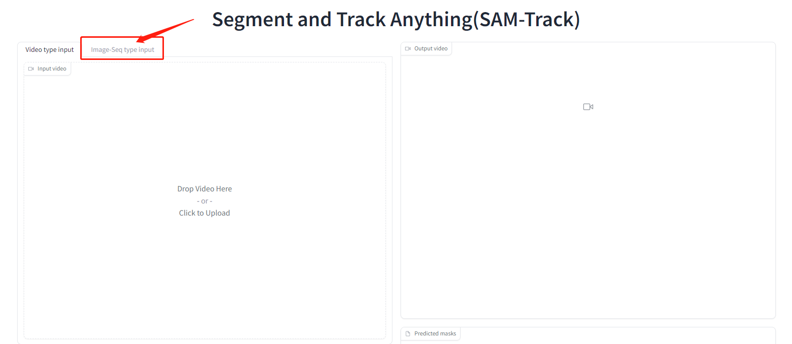
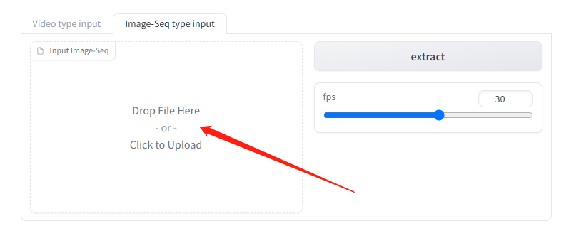
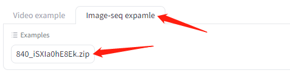
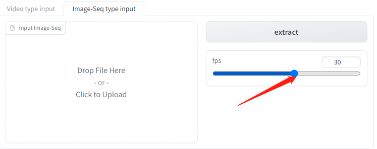

# Tutorial for Image-Sequence input

## Zip the Image-Sequence as input for the WebUI.
**The structure of test-data-seq.zip must be like this. Please confirm that the image names are in ascending order.**
```
- test-data-seq
    - 000000.png
    - 000001.png
    - 000002.png
    - 000003.png
    ....
    - 0000xx.png
```
**Note: Please ensure that the image naming method is in ascending alphabetical order.**

## Use WebUI get test Image-Sequence data
### 1. Switch to the `Image-Seq type input` tab.

 <p align="center"> </p>

### 2. Upload the test dataset or use the provided examples directly.
- Once the test dataset has finished uploading, the WebUI will automatically extract the first frame and display it in the `Segment result of first frame` component.
- If you use the provided examples, you may need to manually extract the results by clicking the `extract` button.
- Below are examples of how to upload an Image-sequence data.

<p align="center"> </p>

### 3. Select fps for the output video

<p align="center"> </p>

### 4. You can follow the [tutorial for WebUI-1.0-Version](./tutorial%20for%20WebUI-1.0-Version.md) to obtain your result.