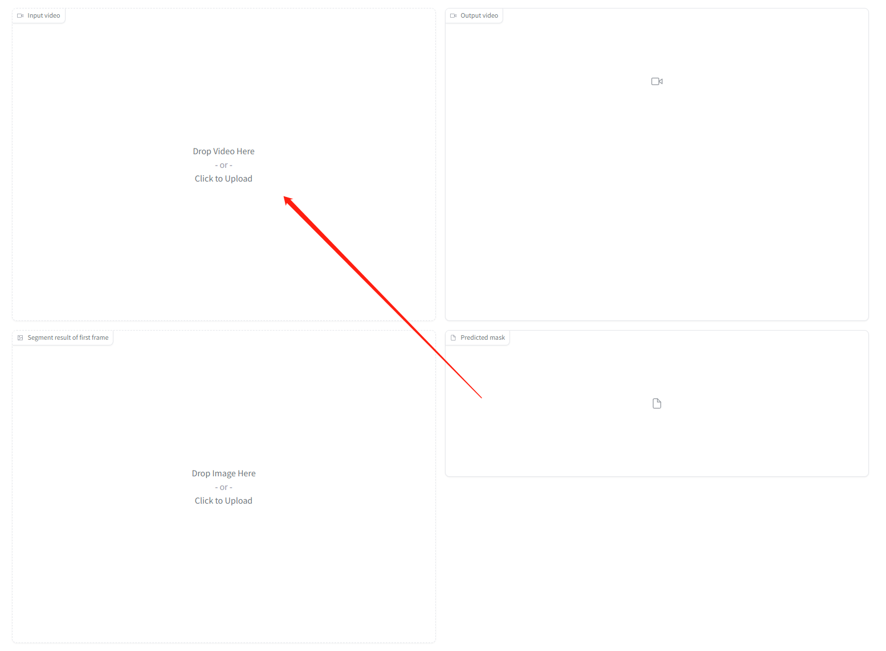
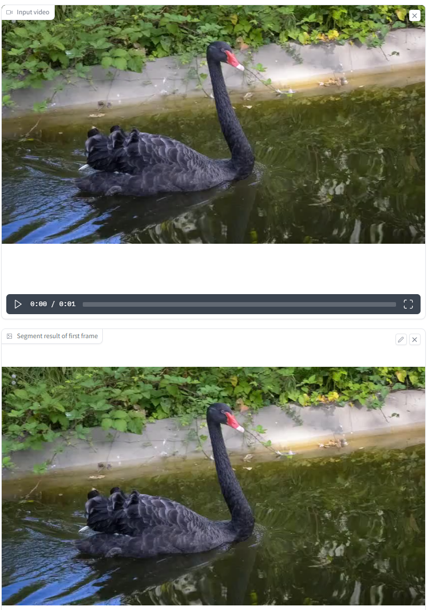
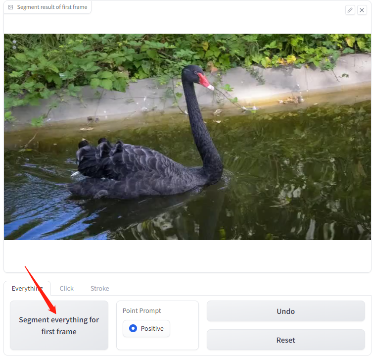
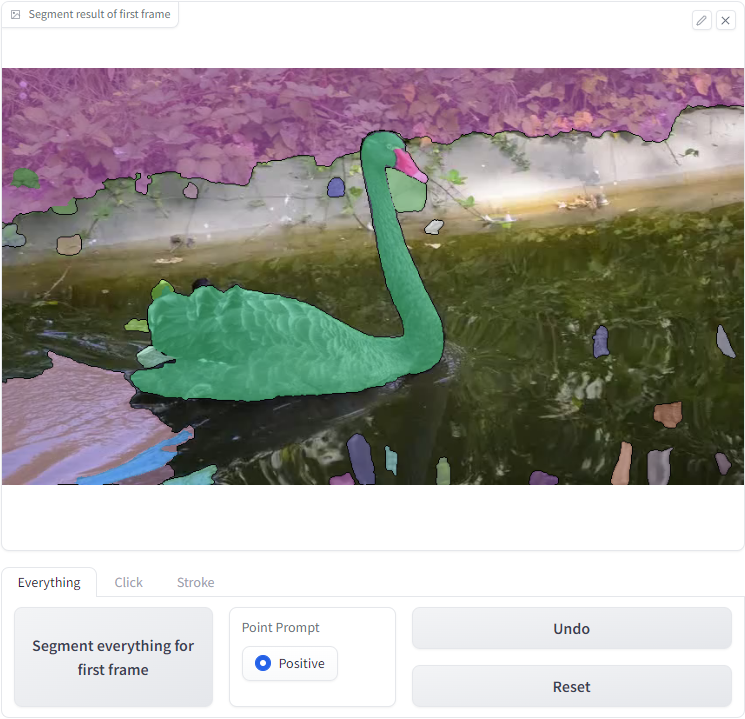
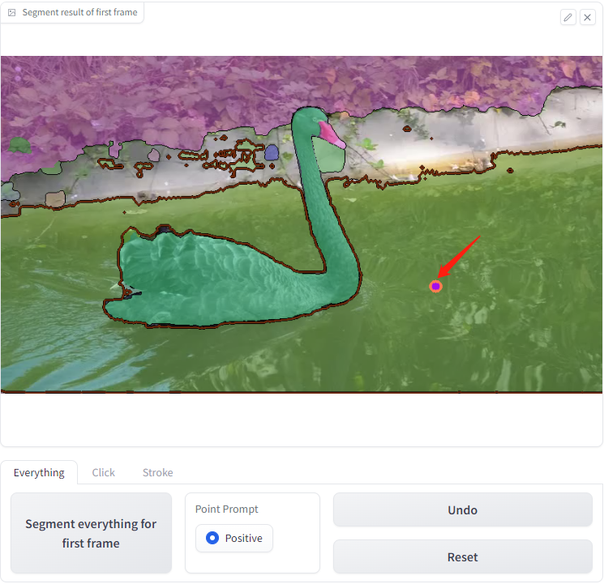
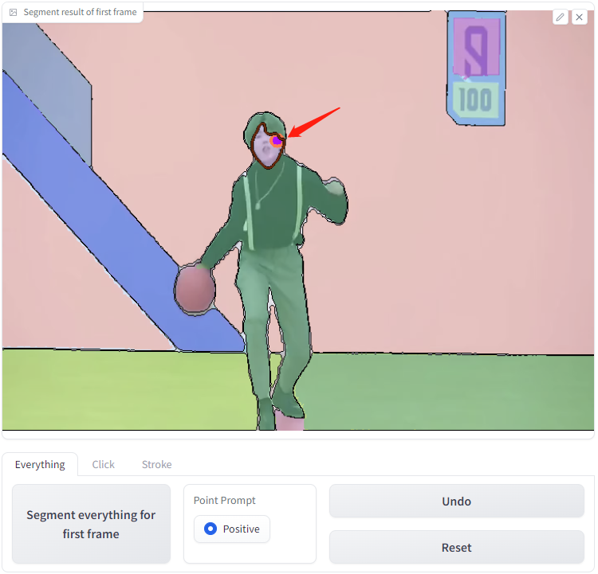
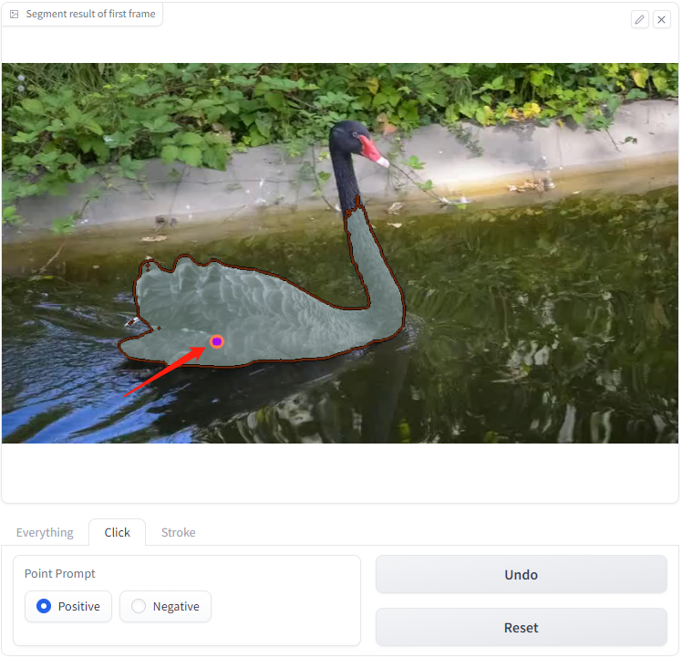
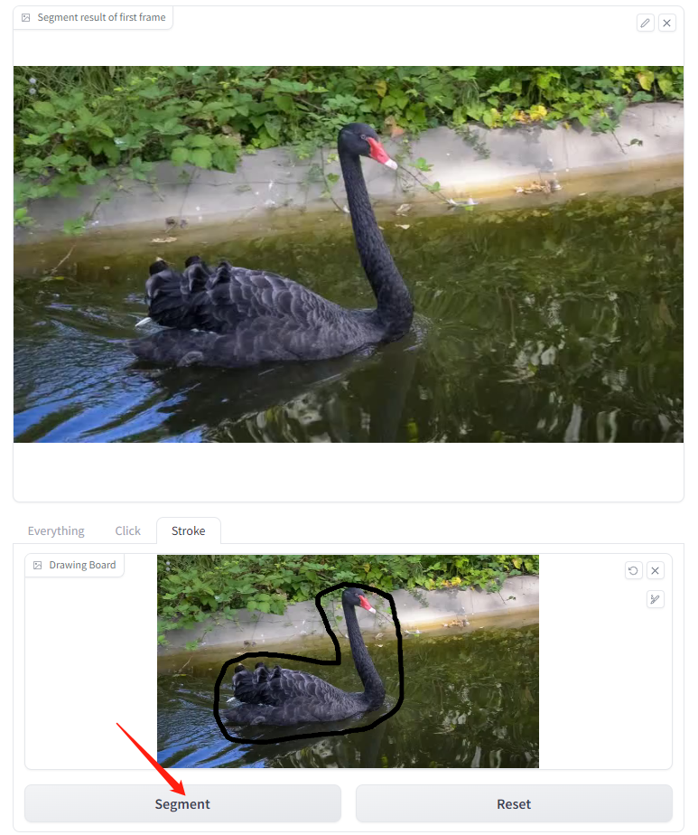
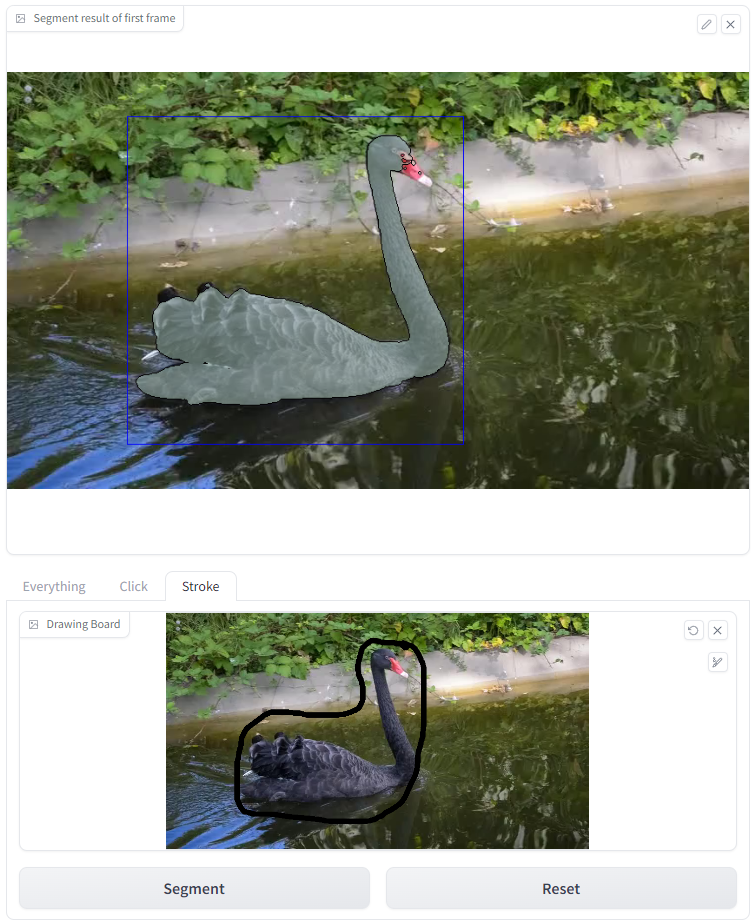
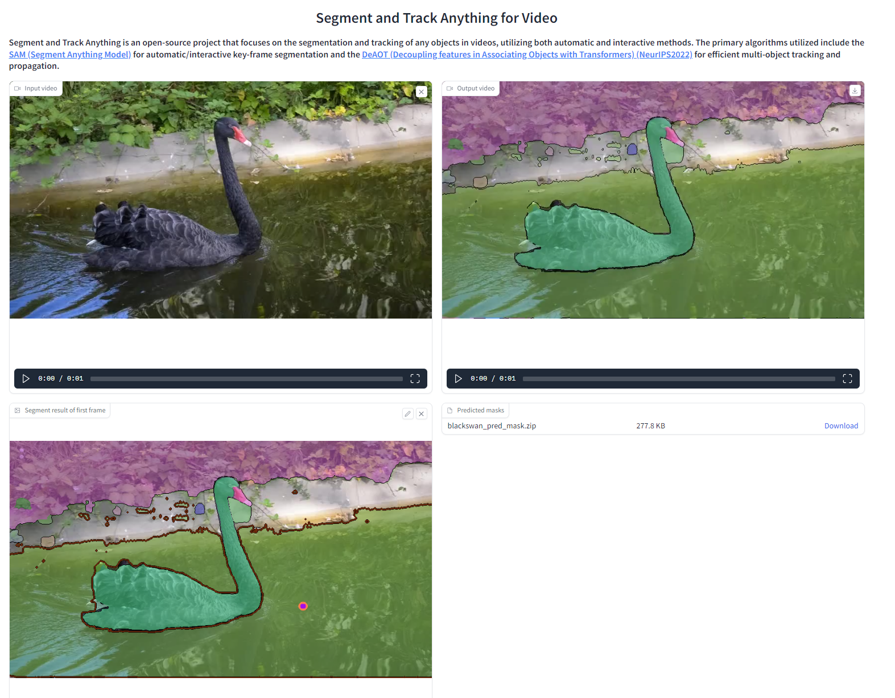

# Tutorial for WebUI 1.0 Version

## Note: 
- We recommend reinitializing SegTracker by clicking the `Reset button` after processing each video to avoid encountering bugs.
- If the `SegTracker-Args` are changed, the SegTracker needs to be reinitialized by clicking the Reset button.
- If the `Drawing board` does not display the image properly, you can refresh the Drawing board by clicking on the `refresh icon` located in the upper right corner of the Drawing board.
- A video tutorial will be released in the next few days.
## 1. About Components
- `input video`: where the uploaded video is displayed for the user to view.
- `Segment result of first frame`: where the segmentation result of the first frame is displayed for the user to view. Under the `Everything-Tab` and `Click-Tab`, users can interactively add a mask by clicking on the displayed result.
- `Drawing board`: where users can circle the object they want to track. This component is only visible under the `Stroke-Tab`.
- `SegTracker-Args`: used to adjust the parameters for initializing SegTracker.
- `Undo`: used to undo a previously added point prompt or segment-everything operation.
- `Reset`: used to reset all components and reinitialize SegTracker.
- `Start Tracking`: used to begin tracking the objects selected by automatic/interactive methods in the video using SegTracker.
- `Output video`: where the tracking results of the video are displayed for the user to view.
- `Predicted masks`: show the predicted masks for each frame of the video.

## 2. Upload your video
- To upload a video, click on the `input video` component. Once uploaded, the `segment result of first frame` component will display the first frame of the video automatically. 
- The examples for uploading a video are shown below.

 
 

## 3. Adjust the SegTracker-Args to suit your needs
 - **aot_model**: used to select which version of DeAOT/AOT to use for tracking and propagation.
 - **sam_gap**: used to control how often SAM is used to add newly appearing objects at specified frame intervals. Increase to decrease the frequency of discovering new targets, but significantly improve speed of inference.
 - **points_per_side**: used to control the number of points per side used for generating masks by sampling a grid over the image. Increasing the size enhances the ability to detect small objects, but larger targets may be segmented into finer granularity.
 - **max_obj_num**: used to limit the maximum number of objects that SegTracker can detect and track. A larger number of objects necessitates a greater utilization of memory, with approximately 16GB of memory capable of processing a maximum of 255 objects.

## 4. Interactively modify single-object mask for first frame of video
### 4.1 Interactively add single-object based on segment-everything(`Everything-Tab`)
- `Segment everything for first frame`: By clicking the button, SegTracker will be initialized based on the `SegTracker-Args`, and `Segment-everything` will be performed on the first frame of the video. 
- The example of the `segment-everything` approach are shown below.

  
 

- `Point Prompt`: After applying the Segment-everything function, you can click on the image to add objects that were ignored by segment-everything or assign a separate ID to an object by doing this. 
- Two examples are provided below: one involves adding water which was previously ignored by the `segment-everything` approach, and the other involves assigning a separate ID to the face of a man.

 

 

- `Note`: The current version only supports adding a mask of the single-object(The added objects are assigned the same ID) on top of the segment everything. We will update the operation of adding multi-objects-mask(The added objects are assigned different IDs) in the feature.

### 4.2 Interactively add object by click(`Click-Tab`)
- `Point Prompt`: you can select objects to track by clicking on the image with positive and negative points.
- SegTracker will segment objects according to the specified prompt-points, as demonstrated in the example below.

  
 

### 4.3 Interactively add object by stroke(`Stroke-Tab`)
- `Drawing board`: You can circle the object you want to track on it.
    - `Undo`: To undo a stroke on the `Drawing board`, click the `Undo button` located in the upper right corner of the `Drawing board`.
    - `Reset`: Click on the `Reset button` in the upper right corner of the `Drawing board` to reset the `Drawing board`.
- `Segment`: SegTracker will receive the mask you draw and display the segmentation results.
- Below is an example demonstrating how to circle and segment an object using strokes.
 
 

- `Note`: 
    - The current version only supports adding a mask for a single-object(The added objects are assigned the same ID).
    - We do not recommend adding a mask by clicking on `Segment result of first frame` under the `Stroke-Tab`, as this may result in bugs.
    
## 5. Segment and Track in Video
- Once the object to be tracked in the video is identified, you can begin tracking by clicking on the `Start Tracking` button. 
- The results are displayed on the `output video` and `predicted masks`.You can download them.

 

