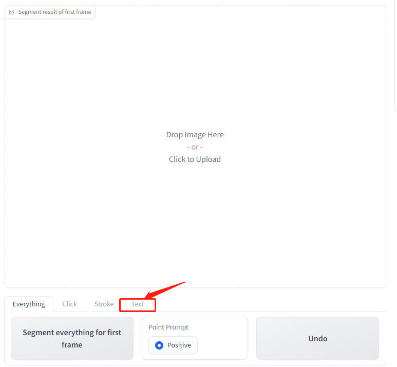
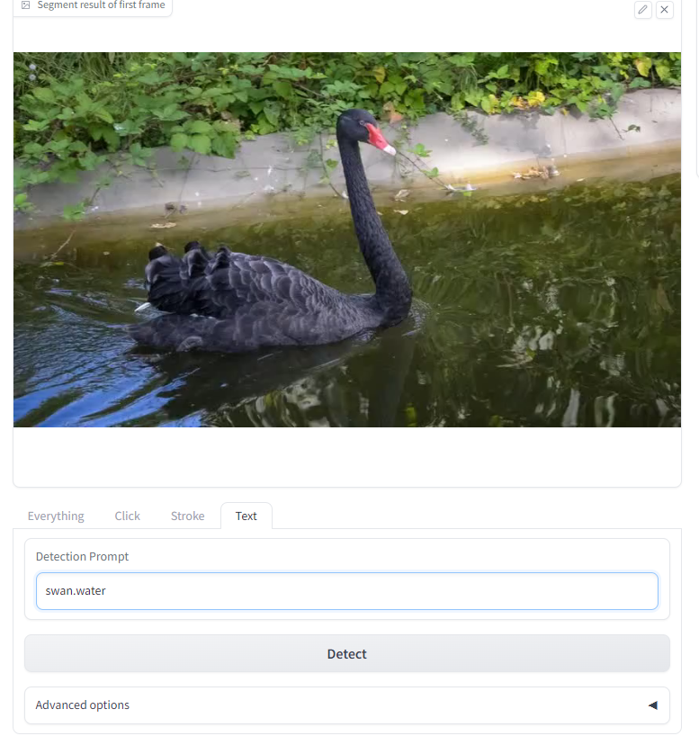
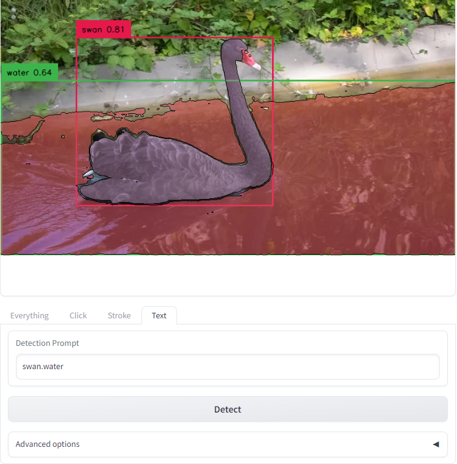
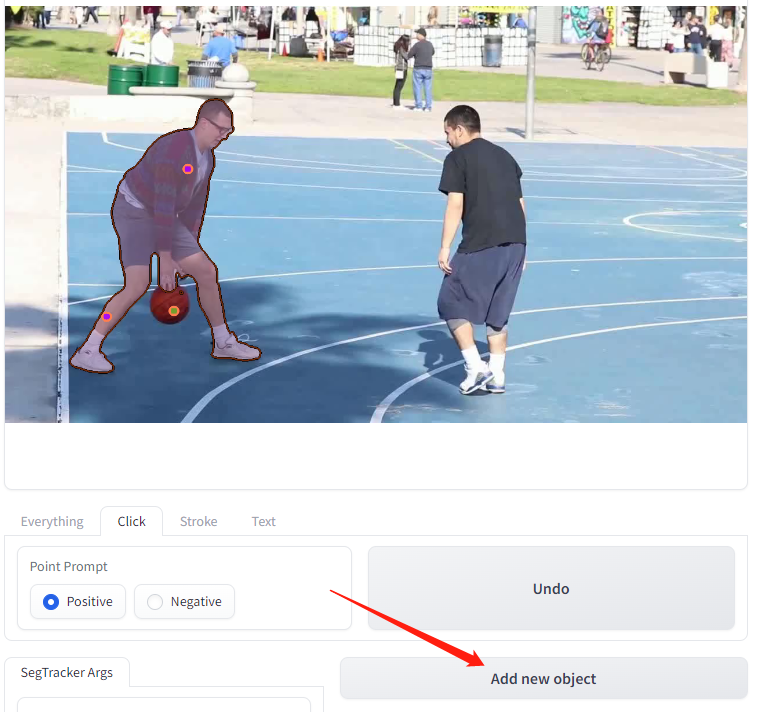
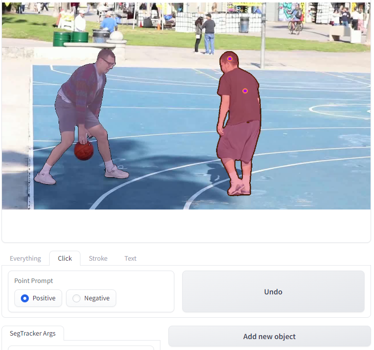

# Tutorial for WebUI 1.5 Version
## We have added two new features
- We have added text prompts to allow for interactive selection of objects that will be tracked in the video.
- We can now interactively add multiple objects for tracking in the video.


## Text-Prompts
### 1. Clone Grounding-DINO to `./src`
```
pip install -e git+https://github.com/IDEA-Research/GroundingDINO.git@main#egg=GroundingDINO
```

### 2. Switch to Text-Tab by clicking `Text` Tab

<p align="center">

</p>

### 3. Upload video or use example dicectly

### 4. Enter text to select the objects you are interested in
- The `.` is used to split text, just like in the original Grounding-Dino setting.

<p align="center">

</p>

### 5. Get mask of selected object by clicking `Detect` button
- SAMTrack initialization may take some time.

<p align="center">

</p>

### 6. Track in video

## Multi-Objects select
### 1. Once we interactively add an object mask, we can click the `Add new object button` to prepare to add a new object.

<p align="center">

</p>

### 2. Add a new object by clicking object

<p align="center">

</p>

### 3. You can add as many objects as you want by clicking `Add new object` button.