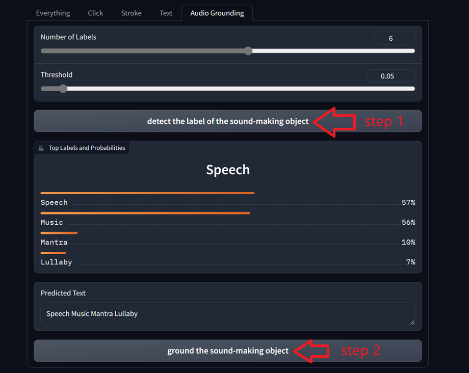

# Tutorial for WebUI 1.6 Version
## We have added one new feature
- We have added an audio-grounding feature that tracks the sound-making object within the video's soundtrack.


## audio-grounding
### 1. Clone the audio-spectrum transformer (AST) model to `./ast_master` and download the pretrained model
```
git clone https://github.com/YuanGongND/ast.git ast_master
wget -O ./ast_master/pretrained_models/audio_mdl.pth https://www.dropbox.com/s/cv4knew8mvbrnvq/audioset_0.4593.pth?dl=1
```

### 2. Switch to Audio-Tab by clicking the `audio-grounding` Tab

<p align="center">

</p>

### 3. Upload video or use example directly

### 4. Alter the number of labels and the confidence interval of the resulting labels according to your personal preference

step 1: detect the label of the sound making object

step 2: ground the sound making object

<p align="center">

</p>

### 5. Get mask of selected object by clicking `Detect` button

### 6. Track in video